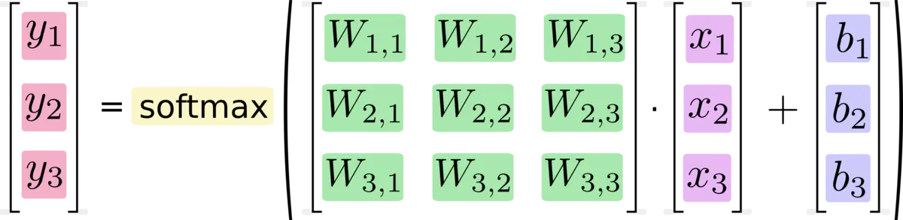
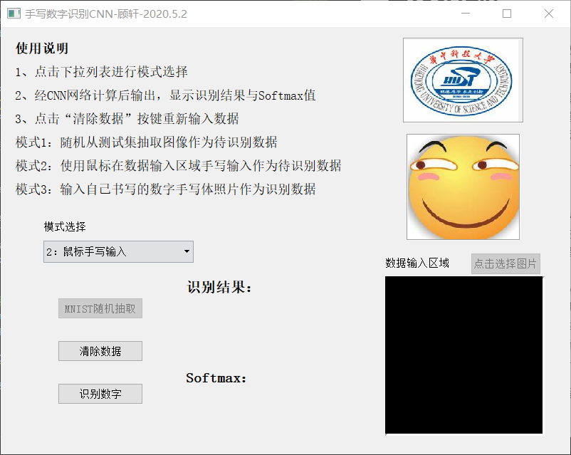

# Handwritten-Numeral-Recognition(数字手写体识别)
该程序通过训练minist_data提供的数字图片来实现数字手写体识别程序的训练，其中相关的minist_data知识可以上网搜索，主要就是采用28*28的图片等等之类的。

关于知识等等东西先不讨论主要是靠自己学习。本次数字手写体识别自己一共尝试了四个版本，当然参考了很多别人的代码，有一个就是在GitHub原作者的程序上进行了改进，多加入了一些功能并写了很多注释，后面将分别介绍各个版本。

可以看到几乎每个文件夹里面都有一个__pycache__文件夹，在这里补充一下相关的知识。
- __pycache__文件夹
  该文件夹用来存储字节码，可以提高python运行速率。本质上说该文件夹和本次程序无关，是个python文件执行之后好像都会生成上面的这个文件夹，这个和python程序的执行过程有关。

  python程序运行时，解释器的具体工作如下：
    1、完成模块的加载和链接；
    2、将源代码编译为PyCodeObject对象(即字节码)，写入内存中，供CPU读取；
    3、从内存中读取并执行，结束后将PyCodeObject写回硬盘当中，也就是复制到.pyc或.pyo文件中，以保存当前目录下所有脚本的字节码文件。

   也就是说下一次运行文件时，就看那里改变了然后整一下字节码，所以python后面的运行速度就比较快，感觉确实是这样，第一次慢，后面快。

实现数字手写体的一个主要思路流程是：输入数据-网络-结果。我们要做的就是训练网络中的参数。如下图所示：
  
当然这是最简单的，复杂的话中间可以加很多网络，还可以采用卷积神经网络(CNN)，常见的是采用卷积神经网络。

下面介绍介绍每个版本，也就是上面的文件夹里面都是什么东西。

## 第一版本
第一版本就是一个my_app_softmax.py文件，就是一个softmax分类函数，网络十分简单，所以训练结果也就一般，大概是在0.91左右。由于这里的识别准确率比较低，便没有保存训练参数结果，只是简单训练并查看一下准确率，其相关程序说明见程序注释，程序注释十分详细。

### 第一版本文件组成
- my_app_softmax.py
  训练模型，得到训练准确率，但结果并未保存

## 第二版本
第二版本主要是自己尝试时网上找的代码，采用了一个隐藏层节点，相比第一版本的准确率有所提高，该版本加上输入输出层一共有三层，再通过softmax进行分类，结果准确率大概在0.97左右。
### 第二版本文件组成
- picture文件夹
  要识别的图象，该图像是自己手写拍照图象，和mnist的数据集图象不同，该图像中含有噪点并且背景为白色，需要进行灰度反转(mnist数据集中图象底色为黑色)。其相关的图片处理函数可以参见
  version2_cnn_无gui->app.py->image_prepare()函数，当中有详细的注释。经过函数输出的是一个784长的一维数组。
  
- MNIST_model文件夹
  训练集训练之后的模型存储的训练之后的模型，避免重复训练，节省时间。但是由于网上发现的该版本主要是采用tf1的，现在本人使用tf2有许多改动，所以很难运通，因此这个采用两层神经网络的版本我就没有深入了解了。copy的博客上说的该网络正确率达到了97左右。她是 version2_cnn_无gui->mnist_train.py文件运行之后得到的模型结果

- version2_cnn_无gui文件夹 
  管文件夹下保存python文件，其中含有四个文件，各作用如下：
  1. minist_train.py
  从minist训练集数据中进行模型训练，需要调用minist_inference文件，该文件用来定义神经网络，好像一共有两层。具体过程就是机器学习的典型流程，这边感觉可以不用参考，主要是采用的tf1。现在换成tf2，好多都变了，不准备理解原作者的代码了，但是实现思路是一样的，这里不注重细节。将训练好的模型保存进入MNIST_model文件夹

  2. minist_iinference.py
   定义神经网络和网络相关的算法等等

  3. minist_eval.py
  进行模型评估，评估训练的模型的准确度，该文件可以改成输入一张图片的识别结果，这在后续操作中会进行。经过3000次训练，准确度大概为0.98

  4. app.py
  进行自己输入图片的降噪等处理，转化为数据输入模型得到识别结果，这部分需要参考，因为一般是训练模型得到准确度，并不太能得到自己输入的结果。尤其是其中对自己图片的处理过程以后可以直接那俩使用，详细过程见代码和注释。
  运行该程序可以得到picture文件夹下的所有图片的识别结果。

## 第三版本
第三版本是自己参考网上教程写的，主要是采用CNN，并且是利用tf（tensorflow）写的，相关注释非常详细，要具体了解算法和实现思路可以去看程序和程序注释。大概一共有三层网络，不算输入输出和最后那部分。准确度较高，可以达到0.99左右。正常情况下训练20000次，但是心疼电脑，就没跑太多次，只跑了2000次，不过结果也比前面的结果要好一点。想要更高准确率的可以把my_app_cnn_train程序训练次数改成20000。

具体细节看代码，注释写的非常详细！！！

### 第三版本相关文件
- picture文件夹
  要识别的图象，该图像是自己手写拍照图象，和mnist的数据集图象不同，该图像中含有噪点并且背景为白色，需要进行灰度反转(mnist数据集中图象底色为黑色)。其相关的图片处理函数可以参见
  version2_cnn_无gui->app.py->image_prepare()函数，当中有详细的注释。经过函数输出的是一个784长的一维数组。

  上面这段话我直接复制下来了，作用是一样的。

- my_app_cnn_save文件夹
  该文件夹下存放该模型训练结果，是2000次的训练结果，想要准确的可以按上面说的改成20000次，会自动生成新的训练结果。
  该文件夹下对应的几个文件可以上网搜索，其实就是训练集，测试集，训练集标签，测试集标签

- my_app_cnn文件夹
  该文件夹下存放相关的py文件，主要有两个py文件：
  1. my_app_cnn_train.py
   训练模型，具体细节见代码，注释十分详细。训练所得的模型(2000次)存在my_app_cnn_save文件夹下面。
  2. my_app_cnn_text.py
  测试程序，主要是用来测试我们自己拍的图片(picture文件夹)是否能预测正确，具体过程也见代码，基本和train文件的实现相同，其中也有图像的预处理等等，和前面说的过程一样，不再赘述。

## 第四版本
第四版本是终极版，感觉很牛逼，可能是因为有GUI界面所以很牛逼，这个我花的时间也最长(其实主要是边学边打王者所以用时间较长).

该程序是本人GitHub上寻找并下载的，没有采用tensorflow，但是采用CNN实现数字手写体识别,主要采用np进行矩阵的运算。程序大致过了一下，为了自己理解做了一些注释，这个东西尼玛具体的网络训练中的梯度神魔的还是不好理解的。后来接触算法之后在进行了解吧。大神可以仔细看看，但是我感觉他的准确率未必能赶得上我前面的第三版本，所以可以看出来tf是真的太方便了，这是我第一次接触，后面好好学习。GUI设计感觉还是很酷的，后面专门说这个事情吧。

这个第四版本可以实现下面的功能：
1. mnist数据集随机抽选图片，得到识别结果
2. 自己在面板上画数字，得到识别结果
3. 加载picture下的手写图片，得到识别结果

### 第四版本相关文件
- picture文件夹
  要识别的图象，该图像是自己手写拍照图象，和mnist的数据集图象不同，该图像中含有噪点并且背景为白色，需要进行灰度反转(mnist数据集中图象底色为黑色)。其相关的图片处理函数可以参见
  version2_cnn_无gui->app.py->image_prepare()函数，当中有详细的注释。
  我又复制下来了，反正就是存放自己拍照整的图片。

- mnist-master
  这个文件夹下面存放的是第四版本的所有文件，你点开可以发现有好多个文件，下面解释一下每个文件的作用。
  - common文件夹
    下面存放的是公共函数，主要就是求梯度、网络各层的定义和处理，训练程序、数据得格式转换：比如二维数组转换成一维数组。反正不采用tf这些东西都要自己实现，比较复杂的，感兴趣的可以自己去仔细看看，反正我是看不下去了，我用tensorflow哈哈。
  - dataset文件夹
    这个文件夹下面主要是加载mnist数据集，然后按照一定格式将数据集搞成输入数据，也就是说本来mnist数据集是一对乱东西，我们经过这个处理，能够得到训练集输入列表、训练集标签列表、测试集输入列表、测试集标签列表等等。这个想了解的话具体看mnist.py程序。
    
    另外四个下载的文件就不说了，这个可以自己百度。

  - qt文件夹
    这个文件夹下面主要是生成界面的，生成界面具体细节后面说。这里面layout.py、layout1.py是废物文件，懒得删了，这两个没有用。
    - text.py
      这个文件是经过qt弄完之后再转换成的py文件，具体怎末实现可以去百度，命名比较随意。这个东西实现了面板的大致形状。
    - paintboard.py
      这个是可以鼠标画数字的界面，具体实现过程参考程序或者上网搜索，这一两句话也说不清楚。后面会将该界面和上面实现的大致形状综合起来，形成终极界面。很牛逼
  
  - 剩下的就是那些py文件了，我们一个个来说
    1. params.kpl&deep_convnet_params.kpl---->分别保存着训练生成的参数，顾名思义，一个是简单网络生成的参数，一个是复杂网络生成的参数。
    2. hj.jpg & hk.jpg---->两张图片，一个滑稽脸，一个华科照片，我后面加载到界面上整着玩了。
    3. simple_convnet.py & deep_convnet.py---->分别定义了简单网络的构建，复杂网络的构建。用类实现，里面会预测结果、准确度、生成参数文件、加载参数文件等等，就是一个网络能实现的基本都实现了。当然程序中用到了前面定义的公共函数，具体就不说了，我也说不清楚，蛮复杂，具体可参见程序。
    4. train_convnet.py & train_deepnet.py---->训练网络，这个用到了前面定义的网络类和加载数据等东西，然后生成简单网络和复杂网络的参数结果，存到前面的params.kpl&deep_convnet_params.kpl文件中。
    5. mnist_cnn_gui_main.py---->终极文件，将前面的界面综合在一起，加载前面生成的训练参数，调用网络，能够生成输入的训练结果，支持三种输入方式，具体在界面的那时候已经说了，就是实现的那三个功能

## 第四版本界面设计说明

现在来说说那个界面的制作，大致说一下流程：
1. qt_creater里面绘制界面，生成.ui文件，前面qt文件夹下的layout.ui就是这种文件。至于怎么绘制界面这个可以上网搜搜。
2. 将.ui文件生成.py文件，这个超级方便，上网搜索如何将.ui文件生成.py文件就知道了。
3. 将生成的大致界面和面板结合一块就可以形成最终文件，该过程在mnist_cnn_gui_main.py文件中有，具体可以参考一下，注释比较详细，想了解的可以学习以哈，我不是很会这东西。

界面展示一下：
 
## 注意事项 & 未来工作

### 注意事项
该程序大多是网上找的，还有其他人的GitHub我直接下载的进行一点改进，但是参考的太多懒得整了，就是分享一下相关知识，不赚钱，如果侵权了联系一下我就删除。

我电脑上是tensorflow2.1版本，但是上面没有placeholder模块，需要执行下面这个语句：

    import tensorflow.compat.v1 as tf
    tf.disable_v2_behavior()
要是1.x的版本就不用这样了。

看不懂感觉不要紧，我整这个的时候没有学卷积神经网络，直接拿着一个东西练手，因为我看机器学习西瓜书看完之后知道模型但是不知道怎么实现，就比较感觉学的没用，就直接整东西了。看不懂可以先跳过，大致流程明白就可以，tf是真的牛逼。网络这么发达，大家一块学习吧。

我原来也写了一个数学之美读书笔记，有兴趣的话也可以看一下(滑稽脸)，目前正在写机器学习习惯书的读书笔记并整理相关算法的实现和课后习题的答案！希望不半途而废奥。

### 未来工作
将来工作，可能会考虑学习图象分割相关的知识，实现识别图像上的多个数字。

也可能向字母识别汉字识别等进军，比较懒，好好学学机器学习吧。

## 作者信息
2020.5.2-----顾轩
